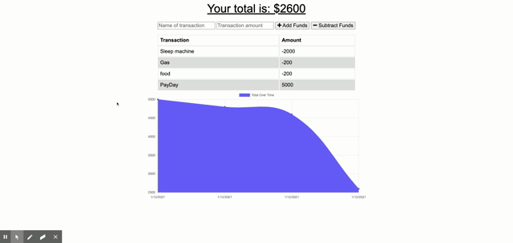

# Progressive-Budget
  
  
  ## **Table of Contents**
  * [Live Link](#live-link)
  * [Description](#description)
  * [Demo](#demo)
  * [Contributors](#contributors)
  * [Technology](#technology-stack)
  * [Questions](#questions)
  * [License](#license)
      
  ## **Live-Link**
  https://radiant-falls-98898.herokuapp.com/
  ## **Description**
  This app allows users to keep track of their budget. The user can add funds or subtract funds depending on money coming in and going out. Users also have the option to install this application to their desktop or device. This application also allows users to track their budget even if they are offline. It will store their transactions using indexedDB and then will process them through to the database once they establish internet connection again. 

  ## **Demo**
  

      
   ## **Contributors**
  The first commit were all files given to me from the Georgia Tech Full Stack Web Development Program (models folder, public folder that included(index.html, index.js, style.css), routes folder, server.js). 

  [Jonathon J. Watson](https://github.com/jonathanjwatson) was a key contributor with this application. His guidance was a crucial part to the applications development.

  ## **Technology-Stack**
  javascript, node.js, express.js, morgan, mongoose, mongoDB, heroku, compression, indexedDB

  ## **Questions**   
  ####    **For any questions or inquiries please contact**
    **Robert Anderson**
  * #### **GitHub:** [@reanderson89](https://github.com/reanderson89)
  * #### **Email:** reanderson89@gmail.com

   
  ## **License**
  MIT
      

